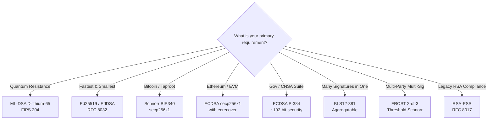

# SignetDSA

<div align="center">

[](https://github.com/MinLee0210/SignetDSA/actions/workflows/ci.yml)
[](https://minlee0210.github.io/SignetDSA)
[](https://www.rust-lang.org)
[](LICENSE)
[-green.svg)](https://csrc.nist.gov/pubs/fips/204/final)
[](https://minlee0210.github.io/SignetDSA/python/)

**Enterprise-grade digital signature library in Rust and Python — classical, threshold, aggregatable, and post-quantum schemes with a unified factory API and JWS token support.**

[Documentation](https://minlee0210.github.io/SignetDSA) • [Python SDK](https://minlee0210.github.io/SignetDSA/python/) • [Algorithm Selection Guide](https://minlee0210.github.io/SignetDSA/learn/choosing_an_algorithm/) • [CLI Reference](https://minlee0210.github.io/SignetDSA/cli/) • [Benchmarks](https://minlee0210.github.io/SignetDSA/features/benchmarking/)

</div>

---

## Overview (Bottom Line Up Front)

**SignetDSA** provides a unified interface for digital signatures in Rust. It eliminates fragmented cryptographic APIs by offering two complementary paradigms:

1. **Typed Static API (`Signature`)**: Zero-cost, compile-time verified static trait with associated types (`type PrivateKey`, `type PublicKey`, `type Error`).
2. **Object-Safe Factory API (`Signet` / `SignetSigner`)**: Runtime dynamic algorithm selection inspired by HuggingFace's `AutoTokenizer.from_pretrained()`, featuring automatic memory zeroization (`zeroize::Zeroizing`) for secret keys.

Additionally, SignetDSA includes high-level utilities for **JSON Web Signatures (JWS RFC 7515)**, **self-contained signed envelopes**, and built-in **micro-benchmarking**.

---

## Supported Digital Signature Schemes

| Algorithm | Category | Classical Security | Private Key | Public Key | Signature | Standard / Specification | Underlying Crate |
| :--- | :--- | :--- | :--- | :--- | :--- | :--- | :--- |
| **RSA** | Classical | ~112-bit (2048b) | ~1.2 KB (DER) | ~270 B (DER) | 256 B | PKCS#1 v1.5 / RFC 8017 | `rsa` |
| **RSA-PSS** | Modern Classical | ~112-bit (2048b) | ~1.2 KB (DER) | ~270 B (DER) | 256 B | RSASSA-PSS / RFC 8017 / FIPS 186-5 | `rsa` |
| **DSA** | Classical | ~112-bit (2048b) | ~617 B (DER) | ~843 B (DER) | ~71 B (DER) | FIPS 186-4 | `dsa` |
| **ECDSA (P-256)** | Classical | ~128-bit | 32 B | 33 B (compressed) | 64 B | NIST FIPS 186-5 / SEC1 | `p256` |
| **ECDSA (P-384)** | Classical (CNSA) | ~192-bit | 48 B | 49 B (compressed) | 96 B | NIST FIPS 186-5 / RFC 6979 | `p384` |
| **ECDSA (secp256k1)** | Classical (Blockchain) | ~128-bit | 32 B | 33 B (compressed) | 64 B | SECG / Ethereum `ecrecover` | `k256` |
| **EdDSA (Ed25519)** | Fast Classical | ~128-bit | 32 B | 32 B | 64 B | RFC 8032 §5.1 | `ed25519-dalek` |
| **Ed448 (Goldilocks)** | High-Margin Classical | ~224-bit | 57 B | 57 B | 114 B | RFC 8032 §5.2 | `ed448-goldilocks-plus` |
| **Schnorr (BIP340)** | Deterministic | ~128-bit | 32 B | 32 B (x-only) | 64 B | Bitcoin BIP340 / Taproot | `k256` |
| **FROST** | Threshold (t-of-n) | ~128-bit | *Split shares* | 32 B (group key) | 64 B | IETF FROST Draft / BIP340 | `frost-secp256k1` |
| **BLS (BLS12-381)** | Aggregatable | ~128-bit | 32 B | 48 B (G1) | 96 B (G2) | IRTF CFRG BLS Draft | `bls-signatures` |
| **ML-DSA (Dilithium-65)** | Post-Quantum | NIST Level 3 (~192b) | 4032 B | 1952 B | 3309 B | NIST FIPS 204 (Module-Lattice) | `ml-dsa` |
| **SLH-DSA (SPHINCS+)** | Post-Quantum | NIST Level 1 (~128b) | 64 B | 32 B | 17088 B | NIST FIPS 205 (Stateless Hash) | `slh-dsa` |

---

## Feature Matrix & Specialized Capabilities

- **JSON Web Signatures (JWS RFC 7515)**: Compact token generation and validation (`JwsCompact`) across all supported algorithms.
- **JSON Web Keys (JWK RFC 7517) & JWKS**: Standard JWK export, parsing, and RFC 7638 SHA-256 thumbprints for OAuth2/OIDC IDPs.
- **COSE Binary Envelopes (RFC 9052)**: Compact CBOR `COSE_Sign1` signing and verification for IoT, WebAuthn/FIDO2 passkeys, and low-bandwidth channels.
- **W3C `did:key` Decentralized Identifiers**: Standard `did:key:z...` derivation and resolution with multicodec headers.
- **Signed Envelopes**: Self-verifying portable JSON messages (`SignetEnvelope`) with embedded public keys and timestamps.
- **Micro-Benchmarking**: In-process benchmarking harness (`Signet::benchmark_all`) reporting ops/sec, latency, and key/sig byte counts.
- **ECDSA Public-Key Recovery**: Reconstruct public keys from `(message, signature, recovery_id)` (`EcdsaSecp256k1::recover_public_key`).
- **BLS Signature Aggregation**: Condense $N$ signatures over $N$ distinct messages into a single 96-byte signature verified via a single pairing equation.
- **Batch Verification**: Multi-signature parallel verification for Ed25519 (`EdDsa::verify_batch`).
- **PKCS#8 / SPKI PEM Import-Export**: Standard OpenSSL interoperable key encoding for RSA, RSA-PSS, DSA, ECDSA (P-256/P-384), and Ed25519.

---

## Quick Start

Add SignetDSA to your `Cargo.toml`:

```toml
[dependencies]
SignetDSA = { git = "https://github.com/MinLee0210/SignetDSA" }
```

### 1. Dynamic Factory API

```rust
use SignetDSA::{Signet, SignetSigner};

// 1. Select algorithm dynamically at runtime
let signer = Signet::from_name("eddsa").expect("valid algorithm");

// 2. Generate keypair (private key is zeroized on drop)
let (private_key, public_key) = signer.generate_keys();

// 3. Sign a message
let message = b"Critical security payload";
let signature = signer.sign(&private_key, message).unwrap();

// 4. Verify signature
let is_valid = signer.verify(&public_key, message, &signature).unwrap();
assert!(is_valid);
```

### 2. JWS Compact Token Serialization (RFC 7515)

```rust
use SignetDSA::{Signet, envelope::JwsCompact};

let signer = Signet::from_name("ecdsa-p384").unwrap();
let (sk, pk) = signer.generate_keys();
let claims = b"sub=1234567890&admin=true";

// Produce compact JWS string: <header>.<payload>.<signature>
let token = JwsCompact::sign("ecdsa-p384", &sk, claims).unwrap();

// Verify and decode payload
let payload = JwsCompact::verify(&token, &pk).unwrap();
assert_eq!(payload, claims);
```

### 3. Self-Contained Signed Envelopes

```rust
use SignetDSA::{Signet, SignetEnvelope};

let signer = Signet::from_name("schnorr").unwrap();
let (sk, pk) = signer.generate_keys();

// Seal into verifiable JSON envelope
let envelope = SignetEnvelope::seal(signer.as_ref(), &sk, &pk, b"Transfer $100").unwrap();
let json_str = envelope.to_json();

// Autonomous verification anywhere
let parsed = SignetEnvelope::from_json(&json_str).unwrap();
assert!(parsed.verify().unwrap());
```

### 4. Python SDK (`signetdsa`)

```python
import signetdsa

# Runtime dynamic algorithm selection
signer = signetdsa.Signet.from_name("eddsa")
sk, pk = signer.generate_keys()

# Signing and verification
signature = signer.sign(sk, b"Signed payload")
assert signer.verify(pk, b"Signed payload", signature) is True

# JWS Compact tokens (RFC 7515)
token = signetdsa.JwsCompact.sign("eddsa", sk, b"claims_data")
assert signetdsa.JwsCompact.verify(token, pk) == b"claims_data"

# Self-contained signed envelopes
envelope = signetdsa.SignetEnvelope.seal(signer, sk, pk, b"Payment payload")
assert envelope.verify() is True
```

See [Python SDK Documentation](https://minlee0210.github.io/SignetDSA/python/) for FROST threshold ceremonies, BLS aggregation, and Ethereum `ecrecover`.

---

## Command-Line Interface (`signetdsa`)

```console
# List all 11 supported algorithms
$ cargo run --bin signetdsa -- list

# Key generation, signing, and verification
$ cargo run --bin signetdsa -- keygen --algo ed25519 --priv-out alice.key --pub-out alice.pub
$ cargo run --bin signetdsa -- sign --algo ed25519 --key alice.key --message "hello" --sig-out hello.sig
$ cargo run --bin signetdsa -- verify --algo ed25519 --pubkey alice.pub --message "hello" --sig hello.sig
VALID

# Run performance benchmark suite
$ cargo run --release --bin signetdsa -- bench --iterations 50

# Self-contained signed envelopes
$ cargo run --bin signetdsa -- envelope-sign --algo ed25519 --key alice.key --pubkey alice.pub --message "data" --out env.json
$ cargo run --bin signetdsa -- envelope-verify --envelope env.json
VALID ENVELOPE [algo: eddsa, created_at: 1788685354]
```

---

## Decision Framework: Which Algorithm Should I Choose?



---

## Frequently Asked Questions (FAQ)

### What is the difference between the typed `Signature` trait and `SignetSigner`?
`Signature` uses associated types (`PrivateKey`, `PublicKey`, `Error`), providing zero-overhead, compile-time type safety for static usage. However, associated types make a trait object-unsafe in Rust (cannot write `Box<dyn Signature>`). `SignetSigner` unifies all keys into serialized byte representations (`Vec<u8>` and `Zeroizing<Vec<u8>>`), allowing runtime dynamic dispatch (`Box<dyn SignetSigner>`).

### Why choose RSA-PSS over traditional RSA PKCS#1 v1.5?
RSA PKCS#1 v1.5 padding is deterministic and carries historical vulnerabilities to padding oracle and chosen-ciphertext attacks (e.g. Marvin Attack [RUSTSEC-2023-0071]). RSA-PSS (RSASSA-PSS, RFC 8017 / FIPS 186-5) introduces randomized salt hashing with MGF1, making it provably secure in the Random Oracle Model.

### How does BLS aggregation defend against rogue-key attacks?
When aggregating signatures, an adversary could submit an artificially crafted public key ($pk' = pk_{victim}^{-1} \cdot pk_{attacker}$) to forge signatures. SignetDSA enforces the standard IRTF CFRG countermeasure requiring distinct messages across signers during aggregate verification (`Bls::verify_aggregated`).

### Is ML-DSA resistant to quantum computers?
Yes. ML-DSA (CRYSTALS-Dilithium, standardized in NIST FIPS 204) is based on the hardness of the Module Learning With Errors (MLWE) lattice problem, for which no efficient quantum algorithm (including Shor's algorithm) is known.

---

## Interoperability & Official Test Vectors

SignetDSA is validated against official specification test vectors:
- **Ed25519**: RFC 8032 §7.1 test vectors ([`tests/rfc8032_ed25519.rs`](tests/rfc8032_ed25519.rs)).
- **Ed448**: RFC 8032 §7.4 test vectors ([`tests/rfc8032_ed448.rs`](tests/rfc8032_ed448.rs)).
- **Schnorr**: Full Bitcoin BIP340 CSV vectors including malleability test cases ([`tests/bip340_schnorr.rs`](tests/bip340_schnorr.rs)).
- **ECDSA P-384**: RFC 6979 §A.2.6 deterministic vectors ([`tests/rfc6979_p384.rs`](tests/rfc6979_p384.rs)).
- **RSA-PSS**: RFC 8017 / PKCS#1 v2.2 test vectors ([`tests/rfc8017_rsa_pss.rs`](tests/rfc8017_rsa_pss.rs)).

---

## License

Licensed under the [MIT License](LICENSE).
